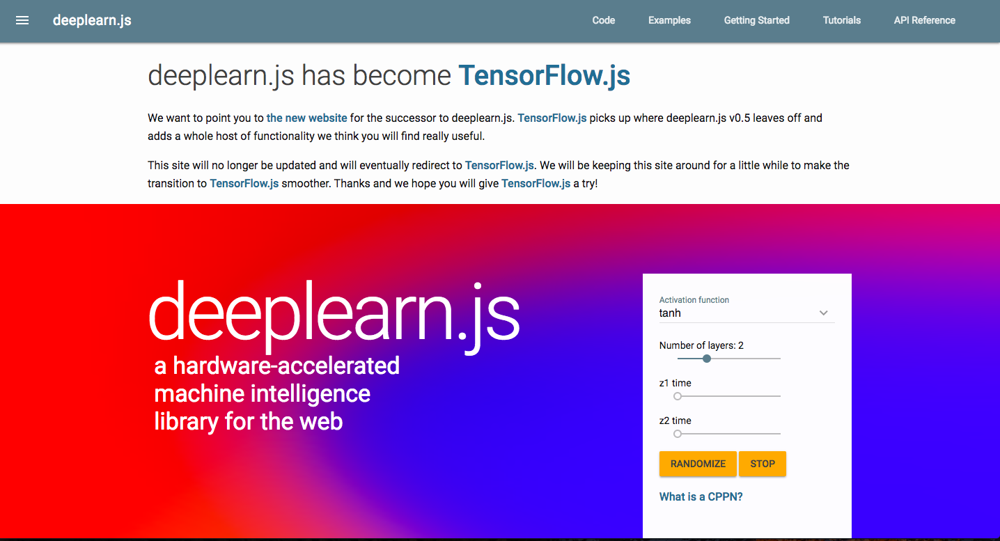

<!-- $theme: gaia -->

# JavaScript MeetUp Okinawa 第3回 LT

###### アイパー隊長

----

## 自己紹介 

* 名前: アイパー隊長（アイパーか隊長で呼んでもらえれば）
* ちゅらデータ株式会社で毎日Python叩いています
* PyData.Okinawaってところでオーガナイザーやっています
* 1年前はWebやっていました
  * jQueryならさわれます


----

## 紹介

PyCon Kyusyu#1が福岡で開催されます！！
* [PyCon Kyushu](http://kyushu.pycon.jp/)


----

# ところでみなさん

----

# JavaScriptでディープラーニングしたくないですか？

----



----


----

## なんかTensorflow.jsってのが
## 出てたので遊んでみた
###### JavaScript MeetUp Okinawa 第3回 LT

----

## Tensorflow.jsとは？

Webブラウザ上で機械学習のモデルの構築、学習、学習済みモデルの実行などが可能になるJavaScriptライブラリ「TensorFlow.js」がGoogleによって公開されました。


引用: http://www.publickey1.jp/blog/18/tensorflowjswebwebglgpu.html

----

また、現時点では **TensorFlow.jsで学習させたモデルをエクスポートする機能は実装されていません。** Node.jsにも対応しておらず、これらは今後の課題となっているとのこと。


残念(´・ω・｀)

----

## 手元で動かしてみる

----

### 2つやり方がある

[tensorflow/tfjs | 公式リポジトリ](https://github.com/tensorflow/tfjs)

* scriptタグでロード -> !?
* npmでinstall

----

## scriptタグでロード

```html
    <!-- Load TensorFlow.js -->
    <script src="https://cdn.jsdelivr.net/npm/@tensorflow/tfjs@0.8.0"> </script>

    <!-- Place your code in the script tag below. You can also use an external .js file -->
    <script>
      const model = tf.sequential();
      model.add(tf.layers.dense({units: 1, inputShape: [1]}));
      model.compile({loss: 'meanSquaredError', optimizer: 'sgd'});

      const xs = tf.tensor2d([1, 2, 3, 4], [4, 1]);
      const ys = tf.tensor2d([1, 3, 5, 7], [4, 1]);

      // Train the model using the data.
      model.fit(xs, ys).then(() => {
        model.predict(tf.tensor2d([5], [1, 1])).print();
      });
    </script>
```

----
### npm 1

```
$ npm install @tensorflow/tfjs
```

* python2.7が必要 -> gypがPython3系に対応していない.
	* [gypってなんぞ？](https://sutaba-mac.site/gyp-not-accept-python3/#gyp)
* nodeのバージョンが9.x.xだとエラー -> node-ffiが対応していない 
	* [Node.jsの世界からダイナミックライブラリの関数を呼ぶ神アドオン](http://www.jonki.net/entry/2014/07/25/003946)
    * 8.x.xへダウングレード
----

### npm 2

適当にソース書く

example.js
```
import * as tf from '@tensorflow/tfjs';

// Define a model for linear regression.
const model = tf.sequential();
model.add(tf.layers.dense({units: 1, inputShape: [1]}));
// さっきscriptタグで書いたやつと同じ
```

index.html
```
<!-- 前後省略 -->
<script src="example.js"></script>
```

----

### npm 3

コンパイル、よくわからなかったので、適当にググって見つけた記事を参考にやりました。

[Parcelで始めるTensorFlow.js (ブラウザ/Node.js)](https://qiita.com/shisama/items/33d34b0b1774f69f8a96)

```
$ npm install -g parcel-bundler
$ parcel build src/index.html --public-url ./
$ open dist/index.html
```

----

## 人のモデルで遊んでみる

----

[【俺妹】大好きな黒猫をディープラーニングで認識しないわけがない【分類編】](http://twdlab.hatenablog.com/entry/2016/10/31/141200)


----

[Intel0tw5727/OreimoDetection](https://github.com/Intel0tw5727/OreimoDetection)


----


----

### やること

1. モデル構造のload
2. モデルの重みをload
3. 動かす

----

### モデル構造のload

https://js.tensorflow.org/tutorials/import-keras.html

ここに従ってやる.
Kerasでできたモデルは変換しないといけないとのこと.

```
$ pip install tensorflowjs
$ tensorflowjs_converter --input_format keras OreimoDetection/LearningData/SGD_2000learn/oreimo_cnn_last_weight.hdf5 ./
```

----


----

# Kerasのバージョン1で組まれていた

----

# やばい(本日の14:20ぐらい)

----


----

# やばい

----

# 急いでKerasを書き直し


----

# 弊社GPUサーバを使って学習

画像: [ほとさんのブログ](http://blog.hotolab.net/entry/gtx1080ti-sli)


----

# できた！！！


----

## 彼がつくったものについて

入力した画像がどのキャラクター（っぽい）かあてる

[彼のブログ](http://twdlab.hatenablog.com/entry/2016/10/25/185215)


----

## で

----

## できた!!!!
###### （まじで色々あったけど省略）

----

## DEMO

----

## まとめ

* Tensorflow書いたことある人からするといい感じだぞ！
* 学習したモデルを出力してほしいけど、Tensorflow, Kerasで作成したモデルを使いまわせるので良い
* GPUサーバは一社に一台あったほうがいい
* 仕事が全然終わっていない！！！